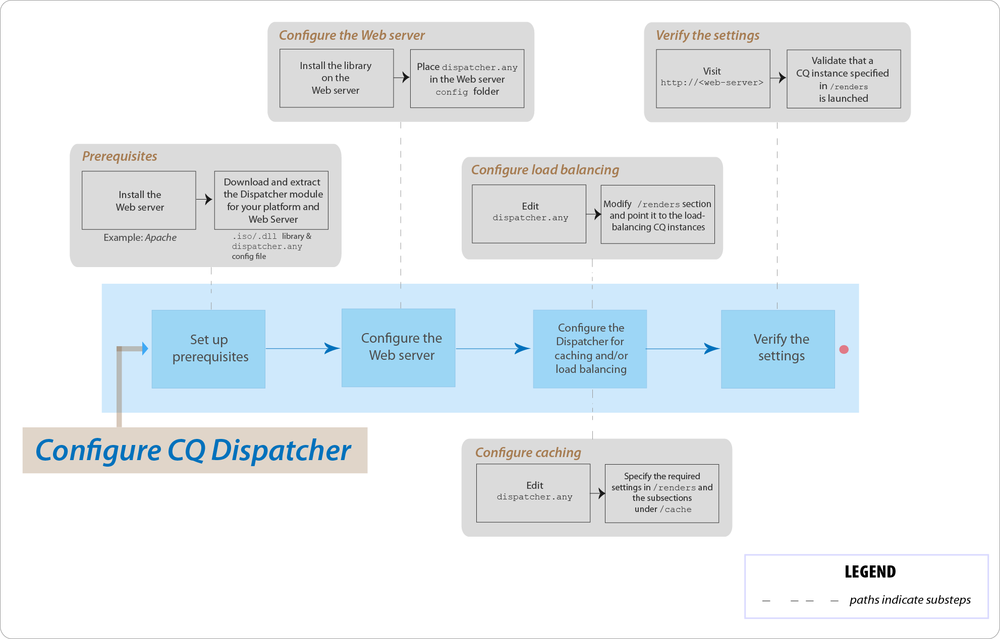

# Veelgestelde vragen over AEM belangrijkste problemen met Verzender



## Inleiding

### Wat is de Dispatcher?

Dispatcher is een Adobe Experience Manager-programma voor het in cache plaatsen en/of taakverdeling dat helpt een snelle en dynamische webontwerpomgeving te realiseren. Voor caching, werkt de Dispatcher als deel van een server van HTTP, zoals Apache. Het heeft als doel de statische inhoud van de website zo veel mogelijk op te slaan (of in cache te plaatsen) en de lay-outengine van de website zo weinig mogelijk te openen. In een lading-in evenwicht brengende rol, verspreidt de Dispatcher gebruikersverzoeken (lading) over verschillende AEM instanties (teruggeeft).

Voor caching, gebruikt de module van de Verzender de capaciteit van de server van het Web om statische inhoud te dienen. De verzender plaatst de caching documenten in de documentwortel van de server van het Web.

### Hoe voert de Dispatcher caching uit?

Dispatcher gebruikt de mogelijkheid van de webserver om statische inhoud te leveren. De Dispatcher slaat cachedocumenten op in de hoofdmap van het document van de webserver. De Dispatcher beschikt over twee primaire methoden voor het bijwerken van de cacheinhoud wanneer wijzigingen in de website worden aangebracht.

* **Inhoud bijwerken** de gewijzigde pagina&#39;s en de bestanden die er direct aan zijn gekoppeld, verwijderen.
* **Automatische validatie** maakt automatisch de delen van het cachegeheugen ongeldig die na een update mogelijk verouderd zijn. Zo worden relevante pagina&#39;s bijvoorbeeld als verouderd gemarkeerd zonder dat er iets wordt verwijderd.

### Wat zijn de voordelen van taakverdeling?

Bij taakverdeling worden gebruikersverzoeken (load) over verschillende AEM verdeeld. In de volgende lijst worden de voordelen voor taakverdeling beschreven:

* **Meer verwerkingskracht**: In de praktijk betekent deze methode dat de Dispatcher documentverzoeken deelt tussen verschillende instanties van AEM. Omdat elke instantie minder documenten te verwerken heeft, hebt u snellere reactietijden. Dispatcher houdt interne statistieken voor elke documentcategorie bij, zodat kan het lading schatten en de vragen efficiënt verspreiden.
* **Verhoogde failover-veilige dekking**: Als de Dispatcher geen reacties van een instantie ontvangt, worden aanvragen automatisch doorgestuurd naar een van de andere instanties. Als een instantie dus niet beschikbaar is, is het enige effect een vertraging van de site, in verhouding tot de verloren computerkracht.

>[!NOTE]
>
>Zie voor meer informatie de [De pagina Overzicht van verzending](dispatcher.md)

## Installeren en configureren

### Waar kan ik de Dispatcher-module downloaden?

U kunt de nieuwste Dispatcher-module downloaden via de [Opmerkingen bij de release Dispatcher](release-notes.md) pagina.

### Hoe installeer ik de module Dispatcher?

Zie de [Dispatcher installeren](dispatcher-install.md) page

### Hoe vorm ik de module van de Verzender?

Zie de [Dispatcher configureren](dispatcher-configuration.md) pagina.

### Hoe vorm ik de Dispatcher voor de auteursinstantie?

Zie [Dispatcher gebruiken met een Auteur-instantie](dispatcher.md#using-a-dispatcher-with-an-author-server) voor de gedetailleerde stappen.

### Hoe vorm ik de Dispatcher met veelvoudige domeinen?

U kunt CQ Dispatcher met veelvoudige domeinen vormen, op voorwaarde dat de domeinen aan de volgende voorwaarden voldoen:

* De inhoud van het Web voor beide domeinen wordt opgeslagen in één enkele AEM bewaarplaats
* De bestanden in de Dispatcher-cache kunnen voor elk domein afzonderlijk ongeldig worden gemaakt

Lezen [Dispatcher gebruiken met meerdere domeinen](dispatcher-domains.md) voor nadere bijzonderheden.

### Hoe vorm ik de Dispatcher, zodat alle verzoeken van een gebruiker aan de zelfde Publish instantie worden verpletterd?

U kunt de [kleverige verbindingen](dispatcher-configuration.md#identifying-a-sticky-connection-folder-stickyconnectionsfor) -functie, die ervoor zorgt dat alle documenten voor een gebruiker op hetzelfde AEM worden verwerkt. Deze functie is belangrijk als u persoonlijke pagina&#39;s en sessiegegevens gebruikt. De gegevens worden opgeslagen op de instantie. Daarom moeten de verdere verzoeken van de zelfde gebruiker aan die instantie terugkeren of het gegeven wordt verloren.

Omdat de kleverige verbindingen de capaciteit van de Verzender beperken om verzoeken te optimaliseren, zou u deze benadering slechts wanneer noodzakelijk moeten gebruiken. U kunt de map opgeven die de &quot;plakke&quot; documenten bevat, zodat alle documenten in die map op hetzelfde exemplaar voor een gebruiker worden verwerkt.

### Kan ik kleverige verbindingen en caching in combinatie gebruiken?

Voor de meeste pagina&#39;s die kleverige verbindingen gebruiken, zou u caching moeten uitzetten. Anders wordt hetzelfde exemplaar van de pagina aan alle gebruikers weergegeven, ongeacht de inhoud van de sessie.

Voor sommige toepassingen kan het mogelijk zijn om zowel kleverige verbindingen als caching te gebruiken. Als u bijvoorbeeld een formulier weergeeft waarin gegevens naar een sessie worden geschreven, kunt u naast elkaar kleverige verbindingen gebruiken en in cache plaatsen.

### Kunnen een Dispatcher en een AEM Publish instantie op de zelfde fysieke machine verblijven?

Ja, als de machine voldoende krachtig is. Het wordt echter aanbevolen de Dispatcher en de AEM Publish-instantie op verschillende computers in te stellen.

Gewoonlijk, verblijft de Publish instantie binnen de firewall en Dispatcher in DMZ. Als u besluit om zowel de instantie Publiceren als de Verzender op de zelfde fysieke machine te hebben, zorg ervoor dat de firewallmontages directe toegang tot de Publish instantie van externe netwerken verbieden.

### Kan ik alleen bestanden met specifieke extensies in cache plaatsen?

Ja. Als u bijvoorbeeld alleen GIF-bestanden in de cache wilt plaatsen, geeft u *.gif op in de cachesectie van het configuratiebestand dispatcher.any.

### Hoe kan ik bestanden uit de cache verwijderen?

U kunt bestanden uit de cache verwijderen met behulp van een HTTP-aanvraag. Wanneer de HTTP-aanvraag wordt ontvangen, verwijdert Dispatcher de bestanden uit de cache. Dispatcher plaatst de bestanden alleen opnieuw in het cachegeheugen als het een clientverzoek voor de pagina ontvangt. Het verwijderen van cachebestanden op deze manier is geschikt voor websites die waarschijnlijk geen gelijktijdige aanvragen voor dezelfde pagina ontvangen.

De HTTP-aanvraag heeft de volgende syntaxis:

```
POST /dispatcher/invalidate.cache HTTP/1.1
CQ-Action: Activate
CQ-Handle: path-pattern
Content-Length: 0
```

Dispatcher verwijdert de cachebestanden en mappen met namen die overeenkomen met de waarde van de CQ-Handle-header. Bijvoorbeeld een CQ-Handle van `/content/geomtrixx-outdoors/en` komt overeen met de volgende items:

Alle bestanden (van een willekeurige bestandsextensie) die en in de map geometrixx-outdoor zijn genoemd.
Elke benoemde map `_jcr_content` onder de map en (die, indien aanwezig, in de cache opgeslagen renderingen van subknooppunten van de pagina bevat).
De map `en` wordt alleen verwijderd als de `CQ-Action` is `Delete` of `Deactivate`.

Zie voor meer informatie over dit onderwerp [De Dispatcher-cache handmatig ongeldig maken](page-invalidate.md).

### Hoe implementeer ik toestemming-gevoelige caching?

Zie de [Beveiligde inhoud cachen](permissions-cache.md) pagina.

### Hoe kan ik communicatie tussen de instanties Dispatcher en CQ beveiligen?

Zie de [Controlelijst voor beveiliging van verzender](security-checklist.md) en de [Beveiligingschecklist AEM](https://experienceleague.adobe.com/docs/experience-manager-64/administering/security/security-checklist.html?lang=en) pagina&#39;s.

### Verzendprobleem `jcr:content` gewijzigd in `jcr%3acontent`

**Vraag**: De onderneming heeft onlangs een probleem op het niveau van de Verzender geconfronteerd. Een van de AJAX die gegevens van de CQ-gegevensopslagplaats kreeg, had `jcr:content` erin. Dat is gecodeerd naar `jcr%3acontent` resulterend in die verkeerde resultaatreeks.

**Antwoord**: Gebruiken `ResourceResolver.map()` methode om een &#39;Vriendelijke&#39; URL te gebruiken/uitgegeven krijgen verzoeken van en ook om de caching kwestie met Dispatcher op te lossen. De methode map() codeert de `:` dubbelepunt naar onderstrepingstekens en de methode resolve() decodeert deze terug naar de leesbare indeling SLING JCR. Gebruik de methode map() om de URL te genereren die wordt gebruikt in de Ajax-aanroep.

Lees verder: [https://sling.apache.org/documentation/the-sling-engine/mappings-for-resource-resolution.html#namespace-mangling](https://sling.apache.org/documentation/the-sling-engine/mappings-for-resource-resolution.html#namespace-mangling)

## De Dispatcher verwijderen

### Hoe vorm ik de agenten van de Dispatcher op een Publish instantie?

Zie de [Replicatie](https://experienceleague.adobe.com/docs/experience-manager-64/deploying/configuring/replication.html?lang=en#configuring-your-replication-agents) pagina.

### Hoe los ik problemen op die Dispatcher opblazen?

[Zie deze artikelen voor probleemoplossing](https://experienceleague.adobe.com/search.html?lang=en#q=troubleshooting%20dispatcher%20flushing%20issues&amp;sort=relevancy&amp;f:el_product=[Experience%20Manager]).

Als de verrichtingen van de Schrapping de Dispatcher veroorzaken om te spoelen, [gebruik de tijdelijke oplossing in dit communityblogbericht van Sensei Martin](https://mkalugin-cq.blogspot.com/2012/04/i-have-been-working-on-following.html).

### Hoe kan ik DAM-elementen uit de Dispatcher-cache verwijderen?

U kunt de functie voor ketenreplicatie gebruiken. Met deze toegelaten eigenschap, verzendt de Dispatcher flush agent een spoelverzoek wanneer een replicatie van auteur wordt ontvangen.

U schakelt dit als volgt in:

1. [Voer hier de stappen uit](page-invalidate.md#invalidating-dispatcher-cache-from-a-publishing-instance) spoelmiddelen maken bij publicatie
1. Ga naar de configuratie van elke agent en op **Triggers** tabblad, controleert u de **Bij ontvangst** doos.

## Overig

Hoe bepaalt de Dispatcher of een document up-to-date is?
Om te bepalen of een document bijgewerkt is, voert de Dispatcher de volgende handelingen uit:

Hiermee wordt gecontroleerd of het document automatisch wordt ongeldig gemaakt. Als dat niet het geval is, wordt het document als bijgewerkt beschouwd.
Als het document is geconfigureerd voor automatische validatie, controleert de Dispatcher of het ouder of nieuwer is dan de laatste beschikbare wijziging. Als deze ouder is, vraagt de Dispatcher de huidige versie van de AEM instantie en vervangt de versie in het geheime voorgeheugen.

### Hoe retourneert de Dispatcher documenten?

U kunt bepalen of de Dispatcher een document in een cache plaatst met behulp van de [Dispatcher-configuratie](dispatcher-configuration.md) bestand, `dispatcher.any`. De verzender controleert het verzoek aan de lijst van cacheable documenten. Als het document niet in deze lijst staat, wordt het document door de Dispatcher opgevraagd bij het AEM.

De `/rules` Deze eigenschap bepaalt welke documenten in de cache worden geplaatst op basis van het documentpad. Ongeacht de `/rules` eigenschap, Dispatcher plaatst een document nooit in de cache in de volgende omstandigheden:

* De aanvraag-URI bevat een `(?)` vraagteken.
* Het geeft een dynamische pagina aan, zoals een zoekresultaat dat niet in de cache hoeft te worden opgeslagen.
* De bestandsextensie ontbreekt.
* De webserver heeft de extensie nodig om het documenttype (het MIME-type) te bepalen.
* De verificatieheader wordt ingesteld (configureerbaar).
* Als de AEM instantie met de volgende kopballen antwoordt:
   * geen cache
   * no-store
   * moet opnieuw valideren

De Dispatcher slaat cachebestanden op de webserver op alsof ze deel uitmaken van een statische website. Als een gebruiker een document in de cache opvraagt, controleert de Dispatcher of het document bestaat in het bestandssysteem van de webserver. Als dit het geval is, retourneert de Dispatcher de documenten. Als dat niet het geval is, vraagt de Dispatcher het document op bij de AEM instantie.

>[!NOTE]
>
>De methoden GET of HEAD (voor de HTTP-header) kunnen door de Dispatcher in cache worden geplaatst. Zie voor meer informatie over het in cache plaatsen van responsheaders de [HTTP-responsheaders in cache plaatsen](dispatcher-configuration.md#caching-http-response-headers) sectie.

### Kan ik veelvoudige Dispatchers in een opstelling uitvoeren?

Ja. In dergelijke gevallen moet u ervoor zorgen dat beide verzenders rechtstreeks toegang hebben tot de AEM website. Een Dispatcher kan geen verzoeken van een andere Dispatcher verwerken.
