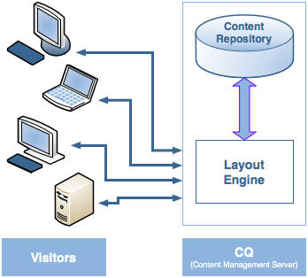
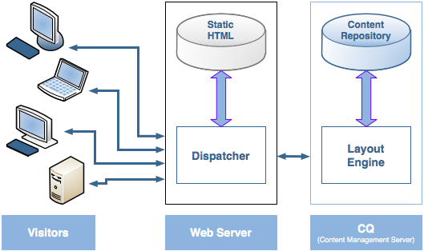
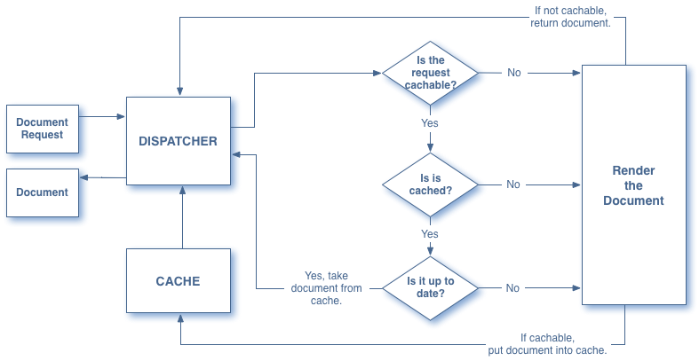
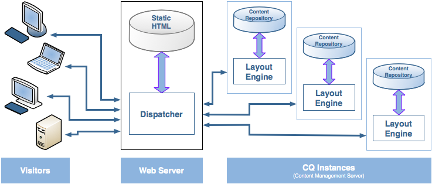

# Overzicht van verzending {#dispatcher-overview}

>[!NOTE]
>
>Dispatcher-versies zijn onafhankelijk van AEM. U bent mogelijk omgeleid naar deze pagina als u een koppeling naar de Dispatcher-documentatie hebt gevolgd die is ingesloten in de documentatie voor een vorige versie van AEM.

Dispatcher is het programma voor het in cache plaatsen en/of taakverdeling van Adobe Experience Manager. Het gebruik van de Dispatcher van AEM helpt ook uw AEM-server tegen aanvallen te beschermen. Daarom kunt u de veiligheid van uw instantie verhogen AEM door de Dispatcher samen met een onderneming-klasse Webserver te gebruiken.

Het proces voor het implementeren van een Dispatcher is onafhankelijk van de webserver en het gekozen besturingssysteem-platform:

1. Meer informatie over Dispatcher (deze pagina). Zie ook [vaak gestelde vragen over dispatcher](https://helpx.adobe.com/experience-manager/using/dispatcher-faq.html).
1. Installeer een [ondersteunde webserver](https://helpx.adobe.com/experience-manager/6-3/sites/deploying/using/technical-requirements.html) volgens de documentatie van de webserver.

1. [Installeer de module](dispatcher-install.md) Dispatcher op uw webserver en configureer de webserver dienovereenkomstig.
1. [Configureer Dispatcher](dispatcher-configuration.md) (het bestand dispatcher.any).

1. [Configureer AEM](page-invalidate.md) zodanig dat updates van de inhoud de cache ongeldig maken.

>[!NOTE]
>
>Zie [Vraag de communautaire deskundigen van AEM naar juli 2017 om meer inzicht te krijgen in de manier waarop Dispatcher met AEM werkt](https://bit.ly/ATACE0717).

Gebruik de volgende informatie zoals vereist:

* [De beveiligingscontrolelijst voor verzending](security-checklist.md)
* [De Dispatcher Knowledge Base](https://helpx.adobe.com/cq/kb/index/dispatcher.html)
* [Een website optimaliseren voor cacheprestaties](https://helpx.adobe.com/experience-manager/6-4/sites/deploying/using/configuring-performance.html)
* [Dispatcher gebruiken met meerdere domeinen](dispatcher-domains.md)
* [SSL gebruiken met Dispatcher](dispatcher-ssl.md)
* [Het uitvoeren van Toestemming-Gevoelige Caching](permissions-cache.md)
* [Problemen met verzending van problemen oplossen](dispatcher-troubleshooting.md)
* [Veelgestelde vragen over de meest voorkomende problemen met Verzender](dispatcher-faq.md)

>[!NOTE]
>
>**Dispatcher** wordt vooral gebruikt om reacties van een AEM- **publicatie-instantie** in de cache op te slaan, zodat u sneller kunt reageren en uw externe website beter kunt beveiligen. Het grootste deel van de discussie gaat over deze zaak.
>
>Maar de Dispatcher kan ook worden gebruikt om de reactiesnelheid van uw **auteur** te verhogen, vooral als u een groot aantal gebruikers hebt die uw website bewerken en bijwerken. Zie [Een verzender gebruiken met een Auteur-server](#using-a-dispatcher-with-an-author-server)hieronder voor meer informatie over dit geval.

## Waarom Dispatcher gebruiken om Caching uit te voeren? {#why-use-dispatcher-to-implement-caching}

Er zijn twee basisbenaderingen voor webpublicatie:

* **Statische webservers**: zoals Apache of IIS zijn heel eenvoudig, maar snel.
* **Servers** voor inhoudsbeheer: die dynamische, in real time, intelligente inhoud verstrekken, maar veel meer computertijd en andere middelen vereisen.

De Dispatcher helpt een omgeving te realiseren die zowel snel als dynamisch is. Het werkt als deel van een statische server van HTML, zoals Apache, met als doel:

* het opslaan (of &quot;in cache plaatsen&quot;) van zoveel mogelijk site-inhoud, in de vorm van een statische website
* zo weinig mogelijk toegang krijgen tot de layout-engine.

Dit betekent dat:

* **statische inhoud** wordt met precies dezelfde snelheid en versnelling verwerkt als op een statische webserver;*daarnaast kunt u de beheer- en beveiligingsgereedschappen gebruiken die beschikbaar zijn voor uw statische webserver(s)*.

* **indien nodig wordt dynamische inhoud** gegenereerd zonder dat het systeem verder wordt vertraagd dan absoluut noodzakelijk is.

Dispatcher bevat mechanismen voor het genereren en bijwerken van statische HTML op basis van de inhoud van de dynamische site. U kunt in detail specificeren welke documenten als statische dossiers worden opgeslagen en die altijd dynamisch worden geproduceerd.

In dit gedeelte worden de beginselen van deze richtlijn toegelicht.

### Statische webserver {#static-web-server}


Een statische webserver, zoals Apache of IIS, levert statische HTML-bestanden aan bezoekers van uw website. Statische pagina&#39;s worden één keer gemaakt, dus voor elke aanvraag wordt dezelfde inhoud geleverd.

Dit proces is zeer eenvoudig en dus uiterst efficiënt. Als een bezoeker een bestand aanvraagt (bijvoorbeeld een HTML-pagina), wordt het bestand meestal rechtstreeks uit het geheugen genomen, in het slechtste geval vanaf het lokale station. Statische webservers zijn al geruime tijd beschikbaar, dus er is een breed scala aan hulpmiddelen voor beheer en beveiligingsbeheer, en ze zijn zeer goed geïntegreerd met netwerkinfrastructuur.

### Servers voor inhoudsbeheer {#content-management-servers}



Als u een server voor inhoudsbeheer gebruikt, zoals AEM, verwerkt een geavanceerde lay-outengine de aanvraag van een bezoeker. De engine leest inhoud uit een opslagplaats die, in combinatie met stijlen, indelingen en toegangsrechten, de inhoud omzet in een document dat is aangepast aan de behoeften en rechten van de bezoeker.

Hierdoor kunt u rijkere, dynamische inhoud maken, waardoor de flexibiliteit en functionaliteit van uw website toenemen. Voor de lay-outengine is echter meer verwerkingskracht nodig dan voor een statische server. Hierdoor kan deze installatie trager worden als veel bezoekers het systeem gebruiken.

## Hoe Dispatcher caching uitvoert {#how-dispatcher-performs-caching}



**De folder** van het Geheime voorgeheugen voor caching, gebruikt de module van de Verzender de capaciteit van de Webserver om statische inhoud te dienen. De verzender plaatst de cachedocumenten in de documenthoofdmap van de webserver.

>[!NOTE]
>
>Als de configuratie voor HTTP-koptekstcache ontbreekt, slaat Dispatcher alleen de HTML-code van de pagina op - de HTTP-headers worden niet opgeslagen. Dit kan een probleem zijn als u verschillende coderingen binnen uw website gebruikt, omdat deze mogelijk verloren gaan. Om HTTP toe te laten Kopbal Caching, zie het [Vormen van het Geheime voorgeheugen van de Verzender.](https://helpx.adobe.com/experience-manager/dispatcher/using/dispatcher-configuration.html)

>[!NOTE]
>
>Als u de hoofdmap van het document van uw webserver zoekt op NAS (Network-Attached Storage), neemt de prestaties af. Ook, wanneer een documentwortel die op NAS wordt gevestigd tussen veelvoudige Webservers wordt gedeeld, kunnen de intermitterende sloten voorkomen wanneer de replicatieacties worden uitgevoerd.

>[!NOTE]
>
>De Dispatcher slaat het cachedocument op in een structuur die gelijk is aan de aangevraagde URL.
>
>Er kunnen beperkingen op besturingssysteemniveau gelden voor de lengte van de bestandsnaam. Dit is bijvoorbeeld het geval als u een URL hebt met veel kiezers.

### Methoden voor het in cache plaatsen

De Dispatcher beschikt over twee primaire methoden voor het bijwerken van de cacheinhoud wanneer wijzigingen in de website worden aangebracht.

* **Met Updates** van inhoud worden de gewijzigde pagina&#39;s en de bestanden verwijderd die er direct aan zijn gekoppeld.
* **De auto-ongeldigverklaring** maakt automatisch die delen van het geheime voorgeheugen onbruikbaar die verouderd kunnen zijn na een update. Dit betekent dat relevante pagina&#39;s in feite als verouderd worden gemarkeerd, zonder dat er iets wordt verwijderd.

### Inhoud bijwerken

In een inhoudsupdate veranderen een of meer AEM-documenten. AEM verzendt een syndicatieverzoek naar de Dispatcher, die het geheime voorgeheugen dienovereenkomstig bijwerkt:

1. Hiermee worden de gewijzigde bestanden verwijderd uit de cache.
1. Alle bestanden die met dezelfde greep beginnen, worden uit de cache verwijderd. Als het bestand /en/index.html bijvoorbeeld wordt bijgewerkt, worden alle bestanden die beginnen met /nl/index weergegeven. worden geschrapt. Dankzij dit mechanisme kunt u cacheefficiënte sites ontwerpen, met name voor beeldnavigaties.
1. Het *raakt* de zogenaamde **status**; dit werkt het tijdstempel van het statusbestand bij om de datum van de laatste wijziging aan te geven.

Er zij op gewezen dat:

* Updates van inhoud worden doorgaans gebruikt in combinatie met een ontwerpsysteem dat weet wat moet worden vervangen.
* Bestanden die worden beïnvloed door een update van de inhoud, worden verwijderd, maar niet onmiddellijk vervangen. De volgende keer dat een dergelijk bestand wordt aangevraagd, haalt de Dispatcher het nieuwe bestand op van de AEM-instantie en plaatst het in de cache, waardoor de oude inhoud wordt overschreven.
* Gewoonlijk worden automatisch gegenereerde afbeeldingen die tekst van een pagina bevatten, opgeslagen in afbeeldingsbestanden die beginnen met dezelfde greep, zodat de koppeling bestaat voor verwijdering. U kunt bijvoorbeeld de titeltekst van de pagina mypage.html opslaan als de afbeelding mypage.titlePicture.gif in dezelfde map. Op deze manier wordt de afbeelding automatisch uit de cache verwijderd telkens wanneer de pagina wordt bijgewerkt, zodat u zeker weet dat de afbeelding altijd de huidige versie van de pagina weerspiegelt.
* U hebt mogelijk meerdere statfiles, bijvoorbeeld één per taalmap. Als een pagina wordt bijgewerkt, zoekt AEM naar de volgende bovenliggende map die een bestand met status bevat en *tikt* u op dat bestand.

### Automatische ongeldigmaking

De auto-ongeldigverklaring maakt automatisch delen van het geheime voorgeheugen ongeldig - zonder fysieke het schrappen van om het even welke dossiers. Bij elke update van de inhoud wordt het zogenaamde statfile aangeraakt, zodat het tijdstempel de laatste update van de inhoud weergeeft.

Dispatcher bevat een lijst met bestanden die automatisch worden geannuleerd. Wanneer een document uit die lijst wordt gevraagd, vergelijkt de Dispatcher de datum van het cachedocument met de tijdstempel van het statusbestand:

* als het document in de cache nieuwer is, retourneert de Dispatcher het.
* Als deze ouder is, haalt de Dispatcher de huidige versie op uit de AEM-instantie.

Ook hier moeten enkele punten worden vermeld:

* Automatische ongeldigmaking wordt doorgaans gebruikt wanneer de onderlinge relaties complex zijn, bijvoorbeeld voor HTML-pagina&#39;s. Deze pagina&#39;s bevatten koppelingen en navigatie-items, zodat deze gewoonlijk moeten worden bijgewerkt nadat de inhoud is bijgewerkt. Als u automatisch PDF- of afbeeldingsbestanden hebt gegenereerd, kunt u ook deze automatisch ongeldig maken.
* De automatische ongeldigverklaring impliceert geen actie door de verzender bij updatetijd, behalve voor het aanraken van het statfile. Als u het bestand aanraakt, wordt de cacheinhoud echter automatisch verouderd, zonder dat de inhoud fysiek uit de cache wordt verwijderd.

## Hoe de Verzender Documenten terugkeert {#how-dispatcher-returns-documents}



### Bepalen of een document in cache moet worden geplaatst

U kunt [bepalen welke documenten de Dispatcher in het configuratiedossier](https://helpx.adobe.com/experience-manager/dispatcher/using/dispatcher-configuration.html)in het geheime voorgeheugen onderbrengt. De verzender controleert het verzoek aan de lijst van cacheable documenten. Als het document niet in deze lijst staat, wordt het document door de Dispatcher opgevraagd bij het AEM-exemplaar.

In de volgende gevallen wordt het document *altijd* rechtstreeks bij de AEM-instantie opgevraagd:

* Als de aanvraag-URI een vraagteken &quot;?&quot; bevat. Dit geeft meestal een dynamische pagina aan, zoals een zoekresultaat, dat niet in de cache hoeft te worden opgeslagen.
* De bestandsextensie ontbreekt. De webserver heeft de extensie nodig om het documenttype (het MIME-type) te bepalen.
* De authentificatiekopbal wordt geplaatst (dit kan worden gevormd)

>[!NOTE]
>
>De methoden GET of HEAD (voor de HTTP-header) kunnen door de Dispatcher in cache worden geplaatst. Zie de sectie Koppen van HTTP-reacties in [cache plaatsen voor meer informatie over het in cache plaatsen van responsheaders](https://helpx.adobe.com/experience-manager/dispatcher/using/dispatcher-configuration.html) .

### Bepalen of een document in de cache is geplaatst

De Dispatcher slaat de cachebestanden op de webserver op alsof ze deel uitmaakten van een statische website. Als een gebruiker een cacheable document aanvraagt, controleert de Dispatcher of dat document bestaat in het bestandssysteem van de webserver:

* Als het document in de cache is opgeslagen, retourneert Dispatcher het bestand.
* als het niet in de cache is opgeslagen, vraagt de Dispatcher het document op bij de AEM-instantie.

### Bepalen of een document up-to-date is

Als u wilt weten of een document up-to-date is, voert de Dispatcher twee stappen uit:

1. Hiermee wordt gecontroleerd of het document automatisch wordt ongeldig gemaakt. Als dat niet het geval is, wordt het document als bijgewerkt beschouwd.
1. Als het document is geconfigureerd voor automatische validatie, controleert de Dispatcher of het ouder of nieuwer is dan de laatste beschikbare wijziging. Als deze ouder is, vraagt de Dispatcher de huidige versie aan bij de AEM-instantie en vervangt hij de versie in de cache.

>[!NOTE]
>
>Documenten zonder **automatische ongeldigmaking** blijven in de cache totdat ze fysiek worden verwijderd. bijvoorbeeld door een inhoudsupdate op de website.

## De voordelen van taakverdeling {#the-benefits-of-load-balancing}

Load Balancing (Load Balancing) is de manier waarop de computerbelasting van de website over verschillende AEM-instanties wordt verdeeld.



U wint:

* **Verhoogde verwerkingscapaciteit** In de praktijk betekent dit dat de Dispatcher verzoeken om documenten deelt tussen verschillende instanties van AEM. Omdat elk exemplaar nu minder documenten te verwerken heeft, hebt u snellere reactietijden. Dispatcher houdt interne statistieken voor elke documentcategorie bij, zodat kan het lading schatten en de vragen efficiënt verspreiden.

* **verhoogde faalveilige dekking** als de Verzender geen reacties van een instantie ontvangt, zal het automatisch verzoeken aan één van andere instantie(s) aflossen. Als een instantie dus niet beschikbaar is, is het enige effect een vertraging van de site, in verhouding tot de verloren computerkracht. Alle services worden echter voortgezet.

* u kunt ook verschillende websites beheren op dezelfde statische webserver.

>[!NOTE]
>
>Terwijl de taakverdeling de belasting efficiënt spreidt, helpt het in cache plaatsen om de belasting te verminderen. Probeer daarom caching te optimaliseren en de totale lading te verminderen alvorens u opstellings lading het in evenwicht brengen. Een goede caching kan de prestaties van het taakverdelingsmechanisme verhogen of het in evenwicht brengen van de belasting onnodig maken.

>[!CAUTION]
>
>Terwijl één enkele Dispatcher gewoonlijk de capaciteit van de beschikbare Publish instanties zal kunnen verzadigen, voor sommige zeldzame toepassingen kan het zinvol zijn om de lading tussen twee instanties van de Verzender extra in evenwicht te brengen. Configuraties met meerdere verzenders moeten zorgvuldig worden overwogen, aangezien een extra verzender de belasting van de beschikbare publicatie-exemplaren verhoogt en de prestaties in de meeste toepassingen gemakkelijk kan verlagen.

## Hoe de Dispatcher taakverdeling uitvoert {#how-the-dispatcher-performs-load-balancing}

### Prestatiestatistieken

Dispatcher houdt interne statistieken bij over hoe snel elke instantie van AEM documenten verwerkt. Gebaseerd op deze gegevens, schat de Verzender welke instantie de snelste reactietijd wanneer het beantwoorden van een verzoek zal verstrekken, en zo behoudt het de noodzakelijke computertijd op die instantie.

Verschillende typen aanvragen kunnen verschillende gemiddelde voltooiingstijden hebben, zodat u met de Dispatcher documentcategorieën kunt opgeven. Deze worden vervolgens meegenomen bij het berekenen van de tijdschattingen. U kunt bijvoorbeeld een onderscheid maken tussen HTML-pagina&#39;s en afbeeldingen, omdat de standaardresponstijden sterk kunnen verschillen.

Als u een uitgebreide zoekfunctie gebruikt, kunt u een nieuwe categorie voor zoekopdrachten maken. Hierdoor kan de Dispatcher zoekopdrachten verzenden naar de instantie die het snelst reageert. Hierdoor wordt voorkomen dat een tragere instantie stagneert wanneer deze meerdere &quot;dure&quot; zoekopdrachten ontvangt, terwijl de andere de &quot;goedkopere&quot; aanvragen ontvangt.

### Persoonlijke inhoud (Vaste verbindingen)

De stevige verbindingen zorgen ervoor dat de documenten voor één gebruiker allen op de zelfde instantie van AEM samengesteld zijn. Dit is belangrijk als u gepersonaliseerde pagina&#39;s en zittingsgegevens gebruikt. De gegevens worden opgeslagen op de instantie, zodat de verdere verzoeken van de zelfde gebruiker aan die instantie moeten terugkeren of het gegeven wordt verloren.

Omdat de kleverige verbindingen de capaciteit van de Dispatcher beperken om de verzoeken te optimaliseren, zou u hen slechts moeten gebruiken wanneer nodig. U kunt de map opgeven die de &quot;plakke&quot; documenten bevat, zodat alle documenten in die map op hetzelfde exemplaar voor elke gebruiker worden samengesteld.

>[!NOTE]
>
>Voor de meeste pagina&#39;s die kleverige verbindingen gebruiken, moet u caching uitschakelen - anders ziet de pagina het zelfde aan alle gebruikers, ongeacht de zittingsinhoud.
>
>Voor een *paar* toepassingen, kan het mogelijk zijn om zowel kleverige verbindingen als caching te gebruiken; bijvoorbeeld als u een formulier weergeeft waarin gegevens naar de sessie worden geschreven.

## Meerdere verzenders gebruiken {#using-multiple-dispatchers}

In complexe instellingen kunt u meerdere verzenders gebruiken. U kunt bijvoorbeeld het volgende gebruiken:

* één verzender om een website op het Intranet te publiceren
* een tweede verzender, onder een ander adres en met verschillende beveiligingsinstellingen, om dezelfde inhoud op internet te publiceren.

In een dergelijk geval, zorg ervoor dat elk verzoek door slechts één Dispatcher gaat. Een Dispatcher behandelt geen verzoeken die afkomstig zijn van een andere Dispatcher. Zorg er daarom voor dat beide verzenders de AEM-website rechtstreeks openen.

## Dispatcher gebruiken met een CDN {#using-dispatcher-with-a-cdn}

Een CDN (Content Delivery Network), zoals Akamai Edge Delivery of Amazon Cloud Front, levert inhoud van een locatie dichtbij de eindgebruiker. Door

* zorgt voor snellere responstijden voor eindgebruikers
* start het laden van uw servers

Als de infrastructuurcomponent van HTTP, werkt een CDN heel erg als Dispatcher: wanneer een knoop CDN een verzoek ontvangt, dient het het verzoek van zijn geheime voorgeheugen indien mogelijk (het middel is beschikbaar in het geheime voorgeheugen en is geldig). Anders, bereikt het uit aan de volgende dichtstbijzijnde server om het middel terug te winnen en het voor verdere verzoeken in het voorgeheugen onder te brengen indien aangewezen.

De &quot;eerstvolgende dichtstbijzijnde server&quot; is afhankelijk van uw specifieke installatie. In een Akamai-configuratie kan het verzoek bijvoorbeeld het volgende pad volgen:

* Het Edge-knooppunt Akamai
* De laag Akamai Midgres
* Uw firewall
* Uw taakverdelingsmechanisme
* Dispatcher
* AEM

In de meeste gevallen is Dispatcher de volgende server die het document vanuit een cache kan aanleveren en de antwoordheaders kan beïnvloeden die aan de CDN-server worden geretourneerd.

## CDN-cache beheren {#controlling-a-cdn-cache}

Er zijn een aantal manieren om te controleren hoe lang een CDN een middel zal in het voorgeheugen onderbrengen alvorens het re-fetches van Dispatcher is.

1. Expliciete configuratie\
   Vorm, hoe lang de bijzondere middelen in het geheime voorgeheugen van CDN, afhankelijk van mime type, uitbreiding, verzoektype, enz. worden gehouden.

1. Verlopen- en cachebeheerkoppen\
   De meeste CDNs zal `Expires:` `Cache-Control:` en de Kopballen van HTTP respecteren indien verzonden door de stroomopwaartse server. Dit kan bijvoorbeeld worden bereikt door de [mod_expired](https://httpd.apache.org/docs/2.4/mod/mod_expires.html) Apache Module te gebruiken.

1. Handmatige validatie\
   CDNs staat middelen toe om uit het geheime voorgeheugen door Webinterfaces worden verwijderd.
1. Op API gebaseerde validatie\
   De meeste CDN&#39;s bieden ook een REST- en/of SOAP-API waarmee bronnen uit de cache kunnen worden verwijderd.

In een standaard AEM opstelling, biedt de configuratie door uitbreiding en/of weg, die door punten 1 en 2 hierboven kan worden bereikt, mogelijkheden om redelijke caching periodes voor vaak-gebruikte middelen te plaatsen die niet vaak veranderen, zoals ontwerpbeelden en cliëntbibliotheken. Wanneer de nieuwe versies worden opgesteld, typisch wordt een handongeldigverklaring vereist.

Als deze benadering wordt gebruikt om beheerde inhoud in het voorgeheugen onder te brengen, impliceert het dat de inhoudsveranderingen slechts aan eind zichtbaar zijn - gebruikers zodra de gevormde caching periode is verlopen en het document opnieuw van Dispatcher wordt opgehaald.

Voor fijnere controle, staat API gebaseerde ongeldigverklaring u toe om het geheime voorgeheugen van een CDN ongeldig te maken aangezien het geheime voorgeheugen van de Verzender ongeldig wordt gemaakt. Gebaseerd op CDNs API, kunt u uw eigen [ContentBuilder](https://helpx.adobe.com/experience-manager/6-5/sites/developing/using/reference-materials/javadoc/com/day/cq/replication/ContentBuilder.html) en [TransportHandler](https://helpx.adobe.com/experience-manager/6-5/sites/developing/using/reference-materials/javadoc/com/day/cq/replication/TransportHandler.html) (als API niet op REST-Gebaseerd is) uitvoeren en opstelling een Agent van de Replicatie die deze zal gebruiken om het geheime voorgeheugen van CDN ongeldig te maken.

>[!NOTE]
>
>Zie ook [AEM (CQ) Dispatcher Security en CDN+Browser Caching](https://www.slideshare.net/andrewmkhoury/dispatcher-caching-aemgemspart2jan2015) en opgenomen presentatie bij [Dispatcher Caching](https://docs.adobe.com/content/ddc/en/gems/dispatcher-caching---new-features-and-optimizations.html).

## Een Dispatcher gebruiken met een Auteur-server {#using-a-dispatcher-with-an-author-server}

>[!CAUTION]
>
>Als u [AEM met Touch UI](https://helpx.adobe.com/experience-manager/6-3/sites/developing/using/touch-ui-concepts.html) gebruikt, zou u **geen** geheime voorgeheugen auteursinhoud moeten in het voorgeheugen onderbrengen. Als caching voor de auteursinstantie werd toegelaten, moet u het onbruikbaar maken en de inhoud van de geheim voorgeheugenfolder schrappen. Als u caching wilt uitschakelen, moet u het `author_dispatcher.any` bestand bewerken en de `/rule` eigenschap van de `/cache` sectie als volgt wijzigen:

```xml
/rules
{
/0000
{ /type "deny" /glob "*"}
}
```

Een Dispatcher kan vóór een auteurinstantie worden gebruikt om auteursprestaties te verbeteren. Ga als volgt te werk om een ontwerpDispatcher te configureren:

1. Installeer een Dispatcher in een webserver (dit kan Apache- of IIS-webserver zijn, zie [Dispatcher](dispatcher-install.md)installeren).
1. Het is verstandig om de zojuist geïnstalleerde Dispatcher te testen op een werkende AEM-publicatie-instantie om te controleren of de basislijn correct is geïnstalleerd.
1. Zorg nu dat de Dispatcher via TCP/IP verbinding kan maken met uw auteurinstantie.
1. Vervang het bestand sample dispatcher.any met de naam auteur_dispatcher.any file met de download [](release-notes.md#downloads)Dispatcher.
1. Open het bestand `author_dispatcher.any` in een teksteditor en breng de volgende wijzigingen aan:

   1. Wijzig de `/hostname` en `/port` van de `/renders` sectie om naar de auteur te verwijzen.
   1. Wijzig de sectie `/docroot` in een `/cache` cachemap. Zie de bovenstaande waarschuwing voor het geval u [AEM met Touch UI](https://helpx.adobe.com/experience-manager/6-3/sites/developing/using/touch-ui-concepts.html)gebruikt.
   1. Sla de wijzigingen op.

1. Verwijder alle bestaande bestanden in de map `/cache` > `/docroot` die u hierboven hebt geconfigureerd.
1. Start de webserver opnieuw.

>[!NOTE]
>
>Houd er rekening mee dat wanneer u met de opgegeven `author_dispatcher.any` configuratie een pakket met CQ5-functies, hotfix of toepassingscode installeert dat invloed heeft op inhoud onder `/libs` of `/apps` dan de cachebestanden onder deze mappen in de cache van de verzender moeten worden verwijderd om ervoor te zorgen dat de nieuwe bijgewerkte bestanden worden opgehaald en niet de oude in de cache opgeslagen bestanden.

>[!CAUTION]
>
>Als u de eerder geconfigureerde auteur dispatcher hebt gebruikt en een *dispatcher spoelagent* hebt ingeschakeld, doet u het volgende:

1. Verwijder of schakel de spoelagent van de **auteur van** de auteur op uw AEM auteursinstantie uit.
1. Voer de configuratie van de auteur-dispatcher opnieuw uit door de bovenstaande nieuwe instructies te volgen.

<!--
[Author Dispatcher configuration file (Dispatcher 4.1.2 or later)](assets/author_dispatchernew.any)
-->
<!--[!NOTE]
>
>A related knowledge base article can be found here:  
>[How to configure the dispatcher in front of an authoring environment](https://helpx.adobe.com/cq/kb/HowToConfigureDispatcherForAuthoringEnvironment.html)
-->
